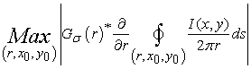
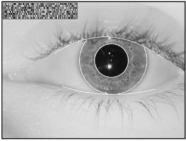
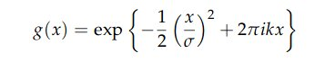
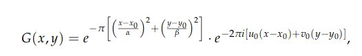
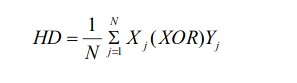

# Biometric Sytem for Iris Recognition

Abstract: This project intends to identify humans by they iris using techniques of image processing. Given a image of eyes, return a validation of that eyes.

#### Table of Contents

- [Dataset](#dataset)

- [Example](#example)

- [Techniques](#tech)

- [Python Implementation](#python)

- [Results](#result)

- [References](#references)


<div id='dataset' >

## **Datasets**:

- *CASIA1*: http://www.cbsr.ia.ac.cn/IrisDatabase.htm 
  

<div id='example' />

## **Image Example:**

##### CASIA1 Image Example

<p align='center'>
    
</p>

### Process


<div id='process' />

1) Process the dataset, make the images more easy to process (there's a possibility to remove eyelashes to earn a more precise image but first, we'll guarantee that the methods here work without worrying about this )
2) We extract the pupils and iris using a couple of techniques (integrodifferential and Hough transform)
3) We normalize the extracted iris to make the comparison possible. In this part, we verify the image using a couple of filters (Gabor/Log-Gabor and, Laplacian of Gaussian)
4) Here it's the comparison part: we check in the database for an image equals/similar to the iris processed. We use Hamming Distance, Euclidian Distance and, Norm Correlation)
5) If the image is in the database, we validate it. If not, there's a possibility to insert for future verifications.


<div id='tech' />

### Techniques used:

##### Finding the iris and eyelids with the Integro-differencial Daugman Operator

Daugman makes use of an intregro-differencial operator for locating the circular iris and pupil regions, and also the arcs of the upper and lower eyelids. The integro-differencial operator is defined as


<p align='center'>
    
</p>

where I(x, y) is the eye image, r is the radius o search for, Go(r) is ta Gaussian smoothing function, and s is the contour of the circle given by r, x0, y0.

The operator searchs for the circular path where there is maximum change in pixel values, by varying the radius and center x and y of the circular contour. The operator is applied iteratively with the amount of the smoothing progressively reduced in order to attain precise localisation. Eyelids are localised in a similar manner, with the path of the contour integration changed from circular to an arc.

Image result after using the operator for iris and eyelids

<p align='center'>
    
</p>


##### Using Hough Transform fo find lines and curves inside the image


<div id='references' />The Hough Transform is a standard computer vision algorithm that can be used to determine the parameters of simple geometric objects, such as lines and circles, present in an image. The circular
<div id='example' />
 Hough transform can be employed to deduce the radius and centre coordinates of the pupil and iris region.

##### Normalization with registers

 Here we use the Wildes method which propose using registers to normalize the regions of the iris. This method deforms and align the iris region to perform the validation..

##### Encoding the features with log Gabor Filters

In this process, we extract the features from the iris and create a biometric model, in this model only the most important information are encoded. We apply the log Gabor filters to extract the features.

###### Log Gabor Filter

1D Dimension:


<p align='center'>
    
</p>

2D Dimensions:


<p align='center'>
    
</p>


##### Model / Template

 The template is two-bits for each filted pixel from the original image, this two-bits representes the possible quadrants. Besides that, we use a noise mask which is responsible to inform the verify process which areas are corrupted because of the eyelids/eyelashes.

##### Hamming Distance

The Hamming distance gives a measure of how many bits are the same between two bit patterns. Using the Hamming distance of two bits pattern, a decision can be made as to wether the two pattersn were generated from differente irises or from the same one.

In the comparing the bit patterns X and Y, the Hamming Distance, HD, is defined as teh sum of disagreeing bits (sum of the exclusiveoR between X and Y) over N, the total number of the bits in the pattern

<p align='center'>
    
</p>

In theory, two iris templates generated from the same iris will have Hamming Distance of 0,0 in practice this will not occur. Normalisation is not perfect, and also there will be some noise goes undetected, so some variation will be present when comparing two intra-class iris templates.

Because of this 'rotational inconsistencies', when the hamming distance of two templates is calculated, one template is shifted left and right bit-siwd and a number of Hamming distance values are calculated from successive shifts. This bit-wise corresponds to rotation of the original iris region by an angle given by the angular resolution used. This method is suggest by DAUGMAN and corrects for misalignments in the normalised iris pattern caused by rotational differences during imaging.

##### Multiprocessing for matching and encoding

 When dealing with multiple files in the dataset (creating the model/templates or comparing a image against the current template database) we use multiple cores, for this we use the ```multiprocessing``` library from python.


<div id='python' />

## Python implementation

Requirements:

```
cloudpickle>=0.6.1
cycler>=0.10.0
dask>=0.20.0
decorator>=4.3.0
kiwisolver>=1.0.1
matplotlib>=3.0.1

networkx>=2.2
numpy>=1.14.2
opencv-python>=3.4.3.18
Pillow>=5.3.0
pyparsing>=2.3.0
python-dateutil>=2.7.5
PyWavelets>=1.0.1
scikit-image>=0.14.1
scipy>=1.1.0
six>=1.11.0
toolz>=0.9.0
tqdm>=4.28.1
```

Install the dependencies with

```pip install -r requirements.txt```

 It's necessary to have opencv installed (or in a virtual enviroment)

To create the datababase from the  CASIA dataset: 

```python createDB_casia1.py ```

 The database will be in the */template* directory


T o verify a specific person for **CASIA Dataset**: 

```python verifyDB_casia1.py --filename 008_2_2.jpg```

<div id='result' />

## Results

- The program works only with images from CASIA1(V1) dataset, so futher improvements is to make generics functions to use in another dataset.
- Because we use multiprocessing, the processing time are fast enough to search in a database for hundreds of images
- IntegroDifferencial it's really hard to understand, rs.

## References

[How Iris Recognition Works - John Daugman](https://www.cl.cam.ac.uk/~jgd1000/csvt.pdf)
